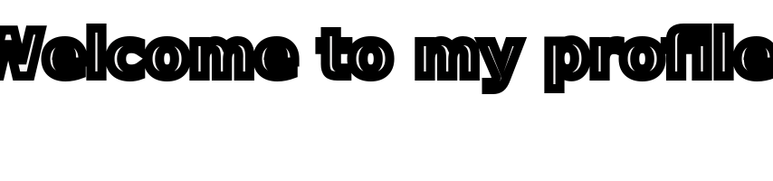

  

  

  <h1>
    
  </h1>

  

  

  

  As a student of SLTC Research University doing Bachelor's in Applied IT, I am currently improving my technology and programming skills along with knowledge in AI. 🧠💻
  I have a passion for web and software development, always excited to learn new things and discover trendy tools in my field.

  Thank you for visiting my profile—I'm excited to connect with you! 🎉

## **My Profile Stats**

  

  

  

  

## **Skills & Technologies**

  
  

  
  

## **Swags**

  

## **Connect with Me**

  

  
  
  
  

  
  

  
  
  
  

## **Support Me**

  

  

  

  

